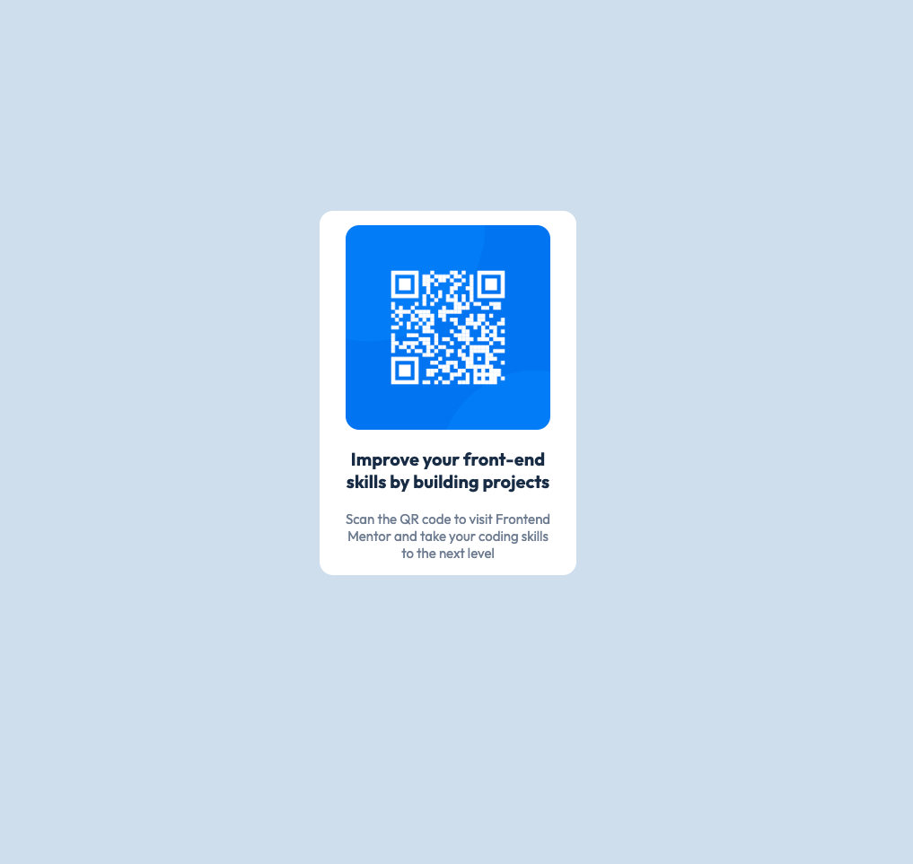

## Overview
QR Code component

### Screenshot

## My process
- I setup the HTML
- Set the on page CSS

### Built with

- Semantic HTML5 markup
- CSS custom properties
- Flexbox

### What I learned

I learned the usefulness of flexbox when it comes to center aligning elements.

### Continued development

I generally need to master layouts using CSS flexbox and Grid

### Useful resources

- [(https://www.w3schools.com) - This helped me as a code resource

## Author

- Frontend Mentor - @JustBenjamin(https://www.frontendmentor.io/JustBenjamin/)

